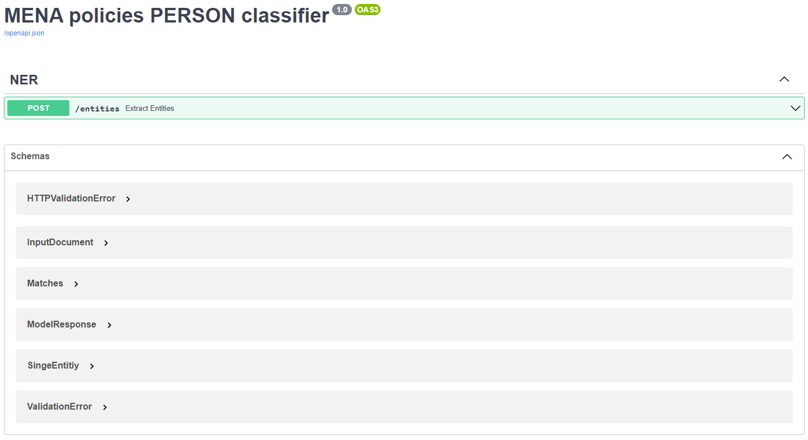
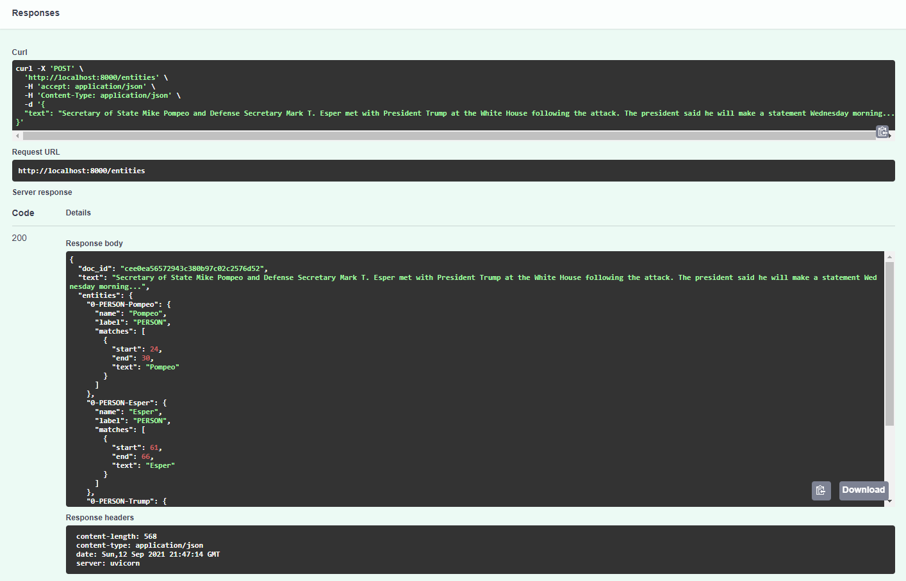

# base-classifier

This repository contains REST API powered by `FastAPI` that
uses custom `spacy` model (trained with `prodigy`) to extract entities
from a given document.  

---





---

## Usage

To use or contribute to this repository, first checkout the code. 
Then create a new virtual environment:

```console
$ git clone https://github.com/hp0404/base-classifier.git
$ python3 -m venv env
$ . env/bin/activate
$ pip install -r requirements.txt
```

Run uvicorn either directly:

```console
$ uvicorn app.main:app --host 0.0.0.0 --reload --debug
```

Or use `docker-compose` instead:

```console
$ docker-compose up --detach --build
``` 